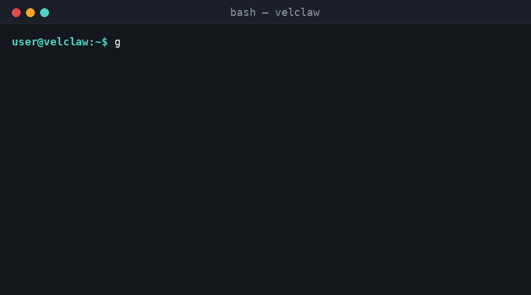

<div align="center">


# Velclaw Workspace

**Mobile-first IDE workspace cho AI agent — files, chat, dashboard trong một file HTML duy nhất.**

<p>


</p>

<p>
<a href="#cài-đặt">Cài đặt</a> ·
<a href="#demo">Demo</a> ·
<a href="#tính-năng">Tính năng</a> ·
<a href="#cấu-trúc">Cấu trúc</a> ·
<a href="#tuỳ-chỉnh">Tuỳ chỉnh</a>
</p>

</div>

---

## Demo

<div align="center">



<sub>Chạy trực tiếp bằng trình duyệt hoặc phục vụ qua local server — không cần build.</sub>

</div>

> 📌 GIF trên là placeholder. Xem mục [Tự tạo GIF demo](#tự-tạo-gif-demo) bên dưới để quay màn hình shell thật của bạn.

## Cài đặt

Chỉ có **một file** — không cần `npm install`, không cần build:

```bash
git clone https://github.com/Velclaw/Velclaw.git
cd Velclaw
```

### Cách 1 — mở trực tiếp

```bash
open workspace.html        # macOS
xdg-open workspace.html    # Linux
start workspace.html       # Windows
```

### Cách 2 — chạy qua local server (khuyến nghị)

```bash
python3 -m http.server 8080
```

Sau đó mở trình duyệt tại `http://localhost:8080/workspace.html`.

## Tính năng

| Tab | Mô tả |
|---|---|
| 📁 **Files** | Cây thư mục dạng slide-over + vùng chỉnh sửa code, đánh dấu file chưa lưu |
| 💬 **Chat** | Giao diện test agent trực tiếp trong workspace |
| 📊 **Dashboard** | Trạng thái deploy, Tools, Connections, chọn model, Logs gần đây |

Toàn bộ dữ liệu mẫu nằm trong khối `<script type="application/json" id="workspace-data">` bên trong `workspace.html` — sửa trực tiếp để thay dữ liệu demo bằng dữ liệu thật.

## Cấu trúc

```text
Velclaw/
├── workspace.html     # toàn bộ app: HTML + CSS + JSON data + JS logic
├── assets/
│   ├── velclaw-logo.svg
│   └── demo-run.gif
└── README.md
```

## Tuỳ chỉnh

Mở `workspace.html`, tìm 3 khối sau để nối dữ liệu thật thay cho dữ liệu demo:

```js
// 1. Đọc/ghi file thật (trong hàm setupFilesPanel)
// TODO: fetch("/api/workspace/file", ...)

// 2. Gọi agent thật (trong hàm setupChatPanel)
// TODO: fetch("/api/agent/chat", ...)

// 3. Trạng thái tools/connections/logs thật (trong hàm setupDashboardPanel)
// TODO: fetch("/api/workspace/status", ...)
```

## Tự tạo GIF demo

Muốn có GIF thực thi shell giống demo trên, dùng một trong các công cụ mã nguồn mở sau — quay màn hình terminal của bạn rồi lưu vào `assets/demo-run.gif`:

```bash
# Cách 1 — terminalizer
npm install -g terminalizer
terminalizer record demo
terminalizer render demo -o assets/demo-run.gif

# Cách 2 — asciinema + agg (convert sang GIF)
asciinema rec demo.cast
agg demo.cast assets/demo-run.gif

# Cách 3 — ttyrec + ttygif (Linux/macOS)
ttyrec demo.tty
ttygif demo.tty -o assets/demo-run
```

Sau khi có file GIF thật, cập nhật lại đường dẫn ảnh trong README này nếu tên file khác `demo-run.gif`.

## Đóng góp

1. Tạo branch nhỏ, gọn.
2. Sửa thẳng trong `workspace.html`.
3. Mở pull request.

## Giấy phép

Xem file `LICENSE` trong repo chính.